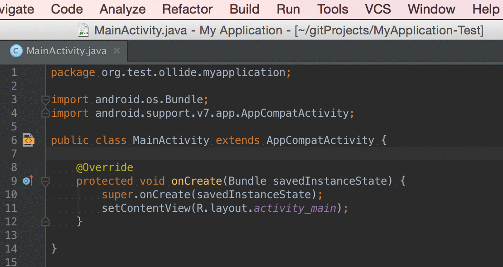

intellij-java2smali
===================

Simple plugin for IntelliJ IDEA &amp; Android Studio to easily compile Java & Kotlin files to smali.

Have you ever compiled and packaged a dummy Android application just to grab some Java sources in smali? Stop that! Transforming Java to smali just got easier.

## Usage ##

1. create or open a Java source file with your desired functionality
2. click 'Build' and 'Compile to smali'
3. wait while IDEA's indicating the compilation process
4. the smali file is opened automatically in your editor

## Installation ##

java2smali is available at [JetBrains Plugin Repository](https://plugins.jetbrains.com/plugin/7385) and can therefore be found in your IDE's plugin manager! Alternatively, you can download the plugin from the release section.

### Build From Source

This plugin uses JetBrains [gradle-intellij-plugin](https://github.com/JetBrains/gradle-intellij-plugin) and can easily build from source.

Clone the repository:

    git clone https://github.com/ollide/intellij-java2smali.git
    cd intellij-java2smali

Build the plugin with Gradle:

    ./gradlew buildPlugin

The plugin can be found in `/build/distributions/java2smali-$VERSION.zip`.

### Third-Party Libraries &amp; Credits ###

- [dx](http://developer.android.com/tools/help/index.html#tools-platform) from the Android platform-tools is used to create a .dex version of the compiled Java (.class) file
- [baksmali](https://github.com/JesusFreke/smali) –
  a great disassembler for Android's dex format is used to create the final .smali output file
- [intellij-emberjs](https://github.com/Turbo87/intellij-emberjs) –
  a nicely written plugin which uses the gradle-intellij-plugin with Kotlin
 