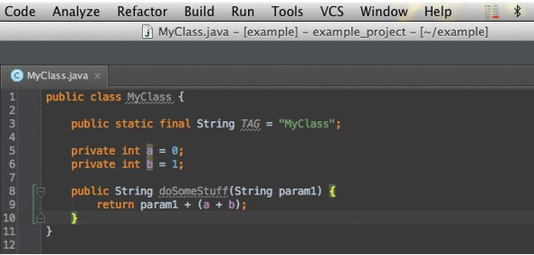

intellij-java2smali
===================

Simple plugin for IntelliJ IDEA &amp; Android Studio to easily compile a Java file to smali.

Have you ever compiled and packaged a dummy Android application just to grab some Java sources in smali? Stop that! Transforming Java to smali just got easier.

### Usage ###

1. create or open a Java source file with your desired functionality
2. click 'Build' and 'Compile to smali'
3. wait while IDEA's indicating the compilation process
4. the smali file is opened automatically in your editor

### Third-Party Libraries &amp; Credits ###

- dx from the Android platform-tools is used to create a .dex version of the compiled Java (.class) file
http://developer.android.com/tools/help/index.html#tools-platform
- baksmali, a great disassembler for Android's dex format, is used to create the final .smali output file https://github.com/JesusFreke/smali
